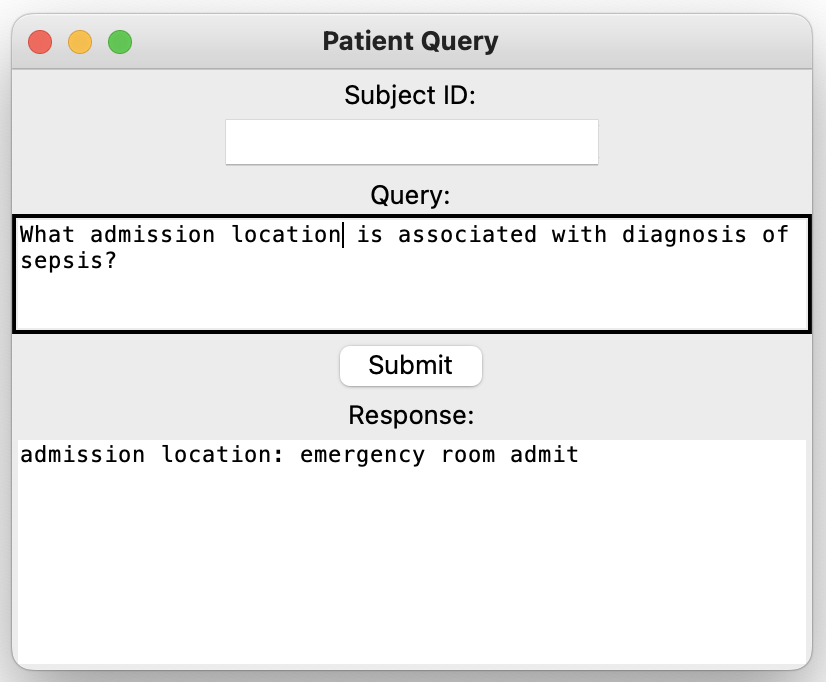

# EHR-Browser

EHR-Browser is a powerful tool that utilizes OpenAI's Davinci-003 language model and a simple graphical user interface (GUI) to enable users to interactively inquire about patient data stored in the MIMIC-III dataset. The MIMIC-III dataset is used to simulate a hospital database. 

This version is not just limited to patient-specific information but is now equipped with the capability to find correlations between random sets of data within the database, providing in-depth analysis when a specific subject_id is not provided. 

## Table of Contents

- [Getting Started](#getting-started)
- [Prerequisites](#prerequisites)
- [Installation](#installation)
- [Usage](#usage)
- [Patient Specific Screenshots](#patient-specific-screenshots)
- [Relational Screenshots](#relational-screenshots)
- [Future Work](#future-work)
- [The Dream](#the-dream)
- [Acknowledgements](#acknowledgements)

## Getting Started

To get a local copy up and running, follow these simple steps.

### Prerequisites

This software uses the following packages:
* Python
* Tkinter
* OpenAI
This software also requires the "demo" MIMIC-III dataset, which is available on PhysioNet (https://physionet.org/content/mimiciii/1.4/). 

### Installation

1. Clone the repo:
```git clone https://github.com/vedshivade/EHR-Browser.git```
2. Install the requirements
```pip install -r requirements.txt```

## Usage

Download the MIMIC-III CSV files from PhysioNet (or use the smaller public 100-patient "demo" set) and place them in the same directory as the script. Note: the files should be '.csv' format.

Run the script:
```python ehr_patient_specific.py```

## Patient-Specific-Screenshots
<p align="center">
  <b>MIMIC-III CSV Files:</b><br>
  <br>
</p>
<p align="center">
  <b>Querying a patient's prescribed medication:</b><br>
  <br>
</p>
<p align="center">
  <b>Increasing the complexity of a query that may take considerable time to manually find the answer to:</b><br>
  <br>
</p>
<p align="center">
  <b>Querying demographic information:</b><br>
  <br>
</p>
<p align="center">
  <b>Asking a question that the constructed patient profile has no answer to:</b><br>
  <br>
</p>
<p align="center">
  <b>Asking a question that Davinci-003 struggles with:</b><br>
  <br>
  <i>Note: While Davinci-003 is a powerful model, it will sometimes struggle with dates and semantics. For example, it should state "discharged to a home health care location" and not "discharged from a home health care location". With regards to dates, this is partly due to the strange way dates are formatted in the MIMIC-III dataset which may be challenging for an LLM to normalize.</i>
</p>

## Relational Screenshots
The relational feature of this browser is still in progress. It does not work all the time. 
<p align="center">
  <b>Querying a religion associated with Hepatitis B:</b><br>
  <br>
</p>
<p align="center">
  <b>Querying a drug given to treat sepsis:</b><br>
  <br>
</p>
<p align="center">
  <b>Querying admission location for sepsis patients:</b><br>
  <br>
</p>
<p align="center">
  <b>Querying the NDC for the drug Senna:</b><br>
  <br>
</p>
<p align="center">
  <b>Asking a question that the browser struggles with:</b><br>
  <br>
</p>

## Future Work
As I continue to develop this "browser," I intend to incorporate a range of features that will provide a more robust and user-friendly experience. Some of these goals include:

### Integration with Other Databases:
Right now, the browser will only work with the MIMIC-III database. Ultimately, the goal is to integrate the browser with actual hospital systems, enabling real-time patient information query. This will require several changes, likely including a shift away from public models like Davinci-003 for PHI security.

### Enhanced GUI Features
The UI is quite simple for now to match the application's functionality. As more features are added, the UI should facilitate productive use.

### Generalizable to Different Sources of Data
Constructing a "patient profile" and then using an LLM to parse it for information is a very flexible framework because it is compatible with unstructured text-based sources. Ideally, one day, the browser should be able to take text-based documents as an input, and not just CSVs. This may include physician notes, lab reports, and other documents that will provide the most well-informed answer.

## The Dream
Imagine a scenario in which a physician is attempting to determine the provenance of a patient's lung cancer. Instead of sifting through 20-30 years of patient data by hand, an intensive and error-prone task, they can instead ask simple queries: "Was this patient ever hospitalized for a respiratory illness previously?" or "Was this patient ever a smoker?" Ideally, the browser will save a significant amount of time and bolster accuracy in diagnoses. 

Enivison another scenario in which a physician has a patient admitted with a pneumonia diagnosis. If they wish to know the treatments prescribed to other patients with similar diagnoses, they could ask the browser: "What drug was given to patients diagnosed with pneumonia?", "What was the dosage of the medication prescribed?", or "Through which route was the medication administered?" This application provides an intuitive and efficient way to access such information.

## Acknowledgements

I want to express my gratitude to the teams behind the MIMIC-III database and OpenAI's Davinci-003 language model. 

The MIMIC-III database, provided by PhysioNet, is a valuable resource for this project, allowing for extensive testing and experimentation with real-world health-related data. The organization and accessibility of this database have greatly facilitated the development of this project. 

Additionally, Davinci-003's ability to understand and generate human-like text provides a powerful tool for handling and interpreting complex medical data.


